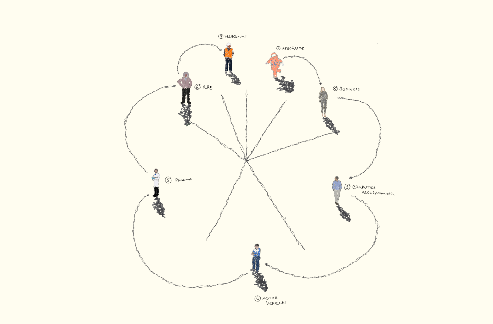
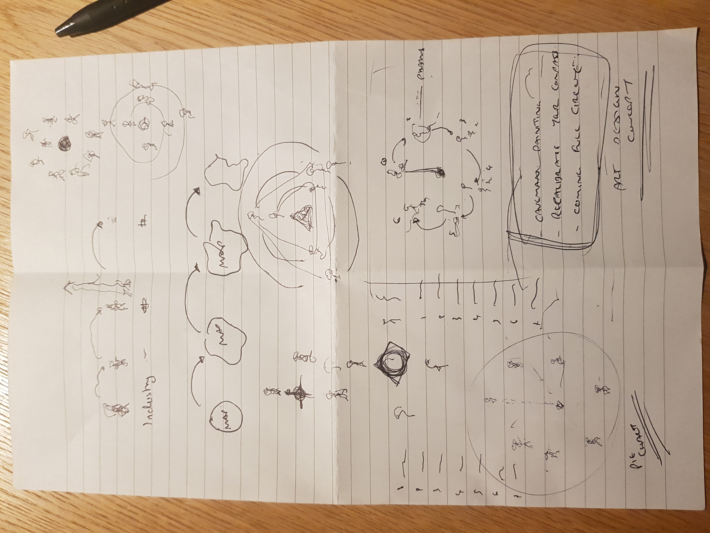
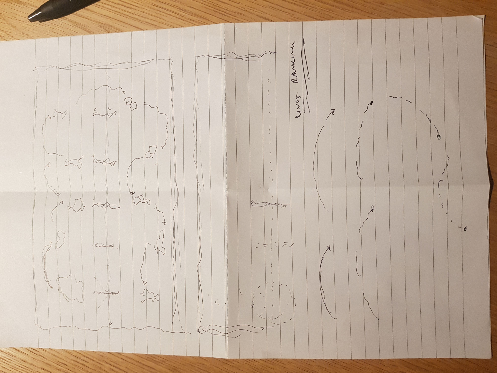

 
@import "../../css/datavis.less"
 
```elm {l=hidden}
import Tidy exposing (..)
import VegaLite exposing (..)
```
 
# Data Visualization Project Summary
 
{(whoami|} Mousuf C Zaman
mousuf-c-zaman.zaman@city.ac.uk {|whoami)}
 
{(task|}
 
You should complete this datavis project summary document and submit it, along with any necessary supplementary files to **Moodle** by **Sunday 19th December, 5pm GMT**. Submissions will be awarded up to **80 marks** towards your coursework assessment total.
 
You are also encouraged to regularly commit and push changes to your datavis project throughout the term as you develop your project.
 
{|task)}
 
{(questions|}
 
The UK is currently the top destination in Europe for venture capital, with inward investors attracted by it’s talented and diverse workforce as well as it’s cutting-edge technologies and services.
 
The Chancellor announced a record increase in public investment in R&D – committing to reaching £22bn per year by 2024/25. This includes how it aim’s to unlock and embrace student talents, diversity, resilience and adaptability, and to tackle it’s biggest challenges. ([Research briefing](#references))
 
World-class research and development depends on talented people working in a diverse culture across multiple sectors and gaining access to the right funding to do their best work.
 
As the UK aims to increase its investment in R&D to 2.4% of GDP by 2027, I want to research how R&D investments are spent and use this to explore the following research questions.
 
- Is the United Kingdom's research and development landscape an important issue to focus on?  
 
- Which industries will allow the most success for a new generation of scientists, researchers, and engineers?
 
- Can I engage students to explore research and development across the regions of UK?
 
My goal is to enable people from all backgrounds and experiences to boost engagement with my visualisations and contribute to research and innovation and showcase that science is for everyone.
 
The questions are inline with the questions being asked by the UK government research and development department. ([R&D roadmap](#references))
 
{|questions)}
 
{(visualization|}
 
### Final
 
```elm {l=hidden}
dataExp =
    dataFromUrl "expenditure1.csv"
```
```elm {l=hidden}
goldenRatio : Float
goldenRatio =
    1.618
```
##### Visualisation 1:
annualUKExpenditureFinal
```elm {l=hidden v}
annualUKExpenditureFinal : Spec
annualUKExpenditureFinal =    
    let
        cfg =
            configure
                << configuration (coView [ vicoStroke Nothing ])
                << configuration
                    (coAxis
                        [ axcoTicks True
                        , axcoDomain False
                        , axcoLabelAngle 0
                        , axcoLabelPadding 0 --
                        ])
        enc =
            encoding
                << position X [ pName "Year"
                    , pTemporal
                    , pAxis [axTitle "United Kingdom's annual expenditure over the years"]
                    ]
                << position Y [ pName "AnnualExpenditure"
                    , pOrdinal
                    , pAxis [axTitle "£"]
                    , pScale[ scZero True ]
                    ]
                << color [ mName "UK Gov"
                    , mQuant
                    , mScale [ scScheme "yellowgreen" [] ]
                    ]
 
    in
    toVegaLite [ width 450
                , height (450 / goldenRatio)
                , cfg[]
                , dataExp []
                , enc []
                , bar [] ]
```
 
##### Visualisation 2:
recruitmentFinal
 
```elm {l=hidden v}
recruitmentFinal : Spec
recruitmentFinal =    
    let
        cfg =
            configure
                << configuration (coView [ vicoStroke Nothing ])
                << configuration
                    (coAxis
                        [ axcoTicks True
                        , axcoDomain False
                        , axcoLabelAngle 0
                        , axcoLabelPadding -0 --
                        ])
        enc =
            encoding
                << position X [ pName "Year"
                    , pTemporal
                    , pAxis [axTitle "R&D Employment"]
                    --, pScale [ scPaddingInner 0.5 ]
                    ]
                << position Y [ pName "Scientists and engineers"
                    , pQuant
                    , pAxis [axTitle "Scientists and engineer"]
                    ]
 
    in
    toVegaLite [ width 450
                , height (450 / goldenRatio)
                , cfg[]
                , dataExp []
                , enc []
                , line [ maFillOpacity 0.5, maColor "rgb(18, 135, 29)" ]
                ]
```
 
##### Visualisation 3:
Top industries in the UK R&D Landscape, I used Adobe Photoshop to create this artwork.

 
##### Visualisation 4.1:
Geo Regional Map of UK, I used Adobe Photoshop to create this artwork.

 
##### Visualisation 4.2:
Geo Regional Map of UK - Ranked regionally in terms of most R&D expenditure, I used Adobe Photoshop to create this artwork.

 
 
{|visualization)}
 
{(insights|}
 
---
 
***1.  Insight one***
 
"annualUKExpenditureFinal" (Visualisation 1 and 2) is a simple bar chart that compares the annual expenditure variable relationship with investment made by the UK government from 2009 through to 2020.
 
This specific data variable relationship has allowed me to interpret and understand the UK R&D landscape and understand if there is an importance to pursue the rest of my research questions.
 
As a result of doing so, I can infer that the UK annual expenditure has spent considerably more in 2020 than 2009 and the pattern combined with available online reports suggests that the United Kingdom's research and development landscape is an important issue to focus on. The UK Gov is the largest funding source of the annual expenditure and their recent heavy investment up to 2020 shows the UK aims to achieve its investment in R&D to 2.4% of GDP by 2027.
 
Having a deeper look to make an interpretation of the data visualisation we can identify that from 2013 to 2020, there has been a consistent growth every year on annual expenditure from private and public funding sources. However between 2009 and 2011, there are inconsistent annual expenditure investment patterns as well as UK Gov public investment patterns.
 
I should mention that there is very little data available before 2009, which points at the lack of importance placed on the UK's research and development and the UK Gov has spent very little in the first 3 years. This points at new research and development policy.
 
I did a quick research following this finding and discovered "UK's 2010 to 2015 government policy: research and development". With in this policy, there was to be the creation of GrothAccelertor, UK Innovation Investment Fund, UK Space Agency, greater funding in National Academies, greater investments made in 7 research councils to invest in R&D, there were:
 
- Arts and Humanities Research Council (AHRC)
- Biotechnology and Biological Sciences Research Council (BBSRC)
- Engineering and Physical Sciences Research Council (EPSRC)
- Economic and Social Research Council (ESRC)
- Medical Research Council (MRC)
- Natural Environment Research Council (NERC)
- Science and Technology Facilities Council (STFC)
 
More importantly, there was the creation of University Enterprise Zones and innovation centers which brought together knowledge, skills, technical resources and capital. ([2010 to 2015 government policy: research and development](#references)) I found further data on recruitment drives for scientists and engineers in R&D for those years and added a paired data visualisation (recruitmentFinal) as evidence to further confirm the requirement of my research, something I would not have been able to verify if not for this visualisation.
 
The UK Gov found great result from investing in R&D outline in the report of 2015, ([The UK Innovation Survey 2015 Main Report](#references)) and from 2013 and 2015 heavier investment were by the UK Gov on top of the private funding.
 
At this point, it is important to explore the UK GDP economic growth to explain the pattern we see above of the UK Gov investment. Although the investment in annual expenditure sees a consistent growth from other founding sources, the UK Gov funding becomes lower from 2015 to 2018. (See investmentsource.csv)
 
I believe this may be due to the fact that UK GDP shrunk by 1.6% from 2014 to 2018, this also explains why the alternative funding source's investment grew considerably during this period. ([UK GDP growth](#references))
 
So far we have just been counting different ways the annual expenditure works however visualizing this alone is not enough. Next we will try to find and show other meaningful patterns in our data sources. ([Jonathan Corum](#references))
 
---
2.  Insight two
 
I focused on the key issue of which industries will give the best potential success to someone new to resaerch and development. 
 
The set of data did included 32 different industry and I decided to focus on the top 7. These were aerospace, business, computer programming, motor vehicles, pharmaceuticals, research and development services, and telecommunications.
 
In 2020, the top 3 industries were pharmaceuticals, computer programming and motor vehicles.
 
##### Ethical data visualisation
 
The latest data available is up to 2020, and we can make a probable assumption that due to COVID-19, investment into vaccine R&D has led to a larger investment into the pharmaceutical industry. ([Houses of Commons Library](#references))
 
However, this does not always mean an ethical investment in research and development. Most of the UK investment in pharmaceutical industry since COVID-19 has been related to the pandemic, however there is a scandal of ethics and how companies attained these R&D funds from the UK Gov. ([Act!onaid](#references))
 
It is my obligations in the Visualization field to have the highest ethical requirements as they possess a great deal of power over how the students will ultimately make use of data both in visual patterns and the conclusions they draw. ([Chapter 5 Ethics](#references))
 
This specific issue is a well known scandal and I will use visualisation 3 only when accompanied with further data on how the pharmaceutical companies attain and spend their R&D funds.
 
##### Lack of variables in data set
When I got to experiment with computer programming industry, I realised that my data is extremely limited. It lacks variables of other information.
 
I was using prior external knowledge to fill in the gaps in my visualisation. This includes having to do a lot of online research.
 
This made me conclude data visualisation is hard without a deeper level of data. This can cause bias as well as ethical issues. 

Going forward, I will ensure to use multiple data variables to cross-reference and compare.
___
 
3.  Insight three

Here I explored the relationship between regions across the UK and expenditure within these regions on R&D.
 
Using an art approach to geoData1.csv data set allowed me to gain a specific insight of top down approach of which regions in the UK should be explored.
 
One of the key takeaways from this was the realisation that regions around London perform considerably better and have more money to invest in research and development then any other regions in the uk.
 
This led me to investigate an unintended line of thought, that the UK has a very high level of regional inequality. I was not expecting this would be a relationship I would explore. Analysis shows UK’s regional inequality worse than 28 other advanced OECD countries and it turns out that wide-ranging evidence suggests that the UK almost certainly has the highest level of regional inequality of any large wealthy country in the world. In many ways, the economic geography of the UK is reminiscent of a much poorer country at an earlier stage of economic development. ([Inequality in UK regions](#references))
 
This is a major concern for having talented students in low R&D expenditure regions falling through the net. If I was to redo this project, I would focus on the detrimental effect of research, development and innovation due to regional inequality.


{|insights)}
 
{(designJustification|}
 
**1.  Choice one**
 
#### Design choice:
 
I needed to visualise the data of UK Research and development, it's relationship with annual expenditure and investment made by the UK Government in the most simplest format (***See visualisation 1 and 2***).
 
I found this to be the best way to answer my first research question, "Is the United Kingdom's research and development landscape an important issue to focus on?".
 
I believe I have got this visualisation correct, as it alone answers the requirement of inspiring young academics into the research and development sector.
 
By making my design choice simple for relationship comparison has allowed me to make the data more natural for the human mind to comprehend and therefore makes it easier to identify specific trends, patterns, and outliers within it. This made the process of asking new questions easy, in addition to this, it allowed me to research questions I otherwise would not have thought to ask. ([Why Data Viz is important][#references])
 
Whilst coming to these new questions, I did look at the structure and leading ways our brains create bias, an abstract example is seeing faces in the clouds. I found it very difficult to filter this process. However, understanding this exists has allowed me to be aware of it and try to overcome this bias as I progress through my research questions and build experience in the future.
 
 
##### Axis
 
This visualization is designed to compare variances and I will ensure to make all my charts to have a consistent approach to how I use my axis.
 
I decided to focus on this as I hope it will allow users to accurately compare the data across each visualization.
 
As a general rule, I will apply the independent" variable on the x-axis and the "dependent" variable on the y-axis and applying the following recommended guidance:
- Be consistent in how you label tick marks.
- Use consistent axes for data visualizations that are being compared.
- Add the unit of measurement to the axis title (i.e. %, £).
- Reduce clutter by not labeling every tick mark.
- Use different size tick marks (like a ruler) when not labeling each tick mark, i.e. use a longer tick mark for every 5th mark. I am not sure how to do this using code yet.
([Axes guidance](#references))
 
 
#### Storytelling
 
To enhance my approach to data visualisation, I settled on a creative approach to storytelling. As I have not done this before I experimented with the CLUE model which looks at every process involved in delivering the current state of narrative. ([Unveiling storytelling and visualization of data](#references))
 
In my experimentation, I found the data axis were very easy to understand without any axis title. I took advantage of this by removing the "Year" label and implemented a simple sentence which annotates what is happening.
 
I found this to be an interactive and an effective approach and I intend on seeing how else I can develop this going forward.
 
#### Human in the loop
For human understanding, approximations highlight a weakness in our approach: not every question can be answered by analytic means. However, we believe that these approximations are sufficient to aid effective usage. These guidelines could be more closely examined (and made more precise) through greater user study and data gathering.
 
I would recommend further reading on Research and development and UK's total expenditure as a whole before looking at the visualisation. This is to give extra knowledge to my target audience and allow them to be able to compare this data.
 
I also added a question before the visualisation to help guide the audience
 
I initially used squares for design choice however I found the bars to be better. This was to help me better determine the relationship between the variables. This gives graphically much more.
 
(-- toVegaLite [ width 540, lec1data [], enc [], **square []** ])
 
 
#### Does design choice answer the question I am trying to answer.
 
This simple design choice shows that the United Kingdom's research and development landscape is an important issue to focus on. UK Gov is the largest  and deciding to use these design choices made
 
___
 
2.  Choice two 
 
Data visualisation
 
I took advantage of Tufte's minimalistic suggestion and looked at the data-ink ratio. I focused on the dimensions of beauty, clarity, effectiveness, and simplicity.  I have also looked at the effective use of colour and visual variables to answer my research question.
 
#### Data tidy
I wanted to make my data less confusing as there are currently 32 industries in my data sets. I was inspired by minimalism and focus on the top 7 fastest growing industries that are leading R&D expenditure.

In excel, I used multiple functions including finding percentage of the data fields in topIndustry1.csv and geoData1.csv.
 
I decided to focus on these as this would be a perfect starting point for students to explore where. If they are interested, they have the option to explore other industries.
 
However, due to my data set no longer being complicated, it is easier to visualise, process and share. I did not have to apply any further transformation to it.
 
 
#### Next
 
Having mentioned above in "insight 2" that I lacked data variables, this led me to abandon the coding visualisation. My skills to use vegalite was not good enough to make a comprehensive piece that will capture attention. My data lacked the quality to deal with the goal of promoting the research and development landscape.
 
This led me to turn to creating a humanistic visualisation. I was inspired by Giorgia Lupi who used simple data to postcards. Simple data can become an intriguing subject point. I wanted to do exactly the same with my design choice. ([See visualisation 3](#visualisation))
 
My first goal was to analyse all experiments I had done using vegalite. This experimentation was primarily looking at minimalism, colour and selective visual variable.
 
The following pie chart stuck with me and I wanted to expand on it by combining data humanism and minimalism.

 
Understanding the importance of sketching ideas on paper, I creating the following: 
 

 
I also took the same approach for visualisation 4 and 4.1.


([Jonathan Corum](#references))
 
From this coursework, what I took away the most is that the possibility is endless when sketching potential data visualisation possibilities. Drawing an idea made a physical representation and it allowed me to see characteristics and relationships of concepts more easily.
 
The final industry ranking sketch focused on our human instincts to draw, it was inspired by caveman paintings. I choose this approach because it is simple!
 
Despite my current finding, I proceeded to experiment further with more advanced data visualization with Edward Tufte's approach for my geographical data visualisation.
 
#### Does design choice answer the question I am trying to answer?
 
My data visualisation did not produce the inspiring revelations I wanted it to do so. It did not lead me to ask further questions to investigate. This led me to go back to basics and go back and read Visualization Analysis and Design by Tamara Munzner before advancing to my final geo data visualization. From this I took away foundational requirements. I will go on to implement this.


_Source: Munzner (2015) p.94_
___
 
*** 3.  Choice three ***
 
For my final data visualisation, I choose to use low-level components of analytic activity in information visualization to carry out the correct tasks which aided my design justification. ([Amar](#references))
 
I believe this was a correct start to my design. Visualisation 4.1 and 4.2 has the persuasive to lead the students to become curious which areas of the countries that they should explore if considering the R&D industry as a career, however not to the effect I wanted it.
 
I was inspired by Edward Tufte to create this however I do believe this needs to be developed much further and it requires further artistic component implementation. ([The visual display of quantitative information by Tufte, Edward](#references))
 
I decided to create the map almost like a treasure map, this takes advantage of visual variable and sense of scale. Visualisation 4.1 is a regional border map of the UK and visualization 4.2 splits the map into 6 columns and 2 rows. It was important for me to maintain a structure to the art piece, so I ensured if the rows and columns had a border matched overlapping, it will recreate the UK map (visualisation 4.2 will look like 4.1 again!).
 
The colour is kept simple, so it adheres to colour blindness.


_Source: Munzner (2015) p.94_

Whilst reading the Munzner (2015) book, the book outlines many foundational requirements like above. I approached it from a slightly different perspective by considering the effectiveness of data encoding.
 
I applied this to the arrows in my visualisation 4.2, each line of the arrow represents count, which goes up by region ranking (1 to 12). The lines also has a curve, this creates a structure, giving an ordering hierachy to the flow of information. ([The visual display of quantitative information by Tufte, Edward. P.25](#references))
 
I wanted to challenge the principle of simplicity and where the fine line is of minimalism as I try to inspire students. This was important as many figures incorrectly present information or, when not incorrect, still use suboptimal data visualization practices. ([Principles of Effective Data Visualization](#references))
 
#### Does design choice answer the question I am trying to answer?
 
As important as it is to use high data-ink ratios, it is equally important to have detailed captions that fully explain everything in my visalisation. My design choice failed to answer my final research questions, q3. However it led to to delve in to a deeper question for the future.

Some things I could have done diffrently are:

I could have added inspiring R&D projects taking place within those regions, I have found the dataset we can use to discover this information, see funding_records1.csv.
 
There could have been contact information for each region, where the viewer of the data visualization could have reached out to. This would have provided not only information, but an immediate call to action.
 
At the beginning of this coursework, I had intended a wider focus to cover all various materials across the 10 lectures. However, due to the data set I chose, I was naturally guided to explore Edward Tufte's data visualization principles combined with fine art data humanism.
 
Having completed the final piece, the information portrayed is not what I desired. It was lacking additional information.

##### Conclusion

In conclusion, I managed to push the boundaries of the minimalistic fine art data visualisation but in this case, I believe a story is better told giving fuller information.
 
This design selection is contrary to the belief of Edward Tufte and I look forward to developing this map and adding further components and exploring the effects from the use of colour.

I will continue to develop data visualization by adding further components and record it's effect.
 
{|designJustification)}
 
{(references|}
 
1. https://commonslibrary.parliament.uk/research-briefings/cbp-7237/
 
2. https://assets.publishing.service.gov.uk/government/uploads/system/uploads/attachment_data/file/896799/UK_Research_and_Development_Roadmap.pdf
 
3. AMAR R., EAGAN J., STASKO J.: Low-Level Components of Analytic Activity in Information Visualization. In IEEE Symposium on Information Visualization (2005), IEEE, pp. 111–117. This can also be found at fig.8 https://docs.google.com/document/d/1BVdyaRfENRLCGrPyy1iYSdm5cWxBtWJJO5CiVLDwr7A/edit
 
4. https://www.gov.uk/government/publications/2010-to-2015-government-policy-research-and-development/2010-to-2015-government-policy-research-and-development
 
5. https://assets.publishing.service.gov.uk/government/uploads/system/uploads/attachment_data/file/536491/UKIS_2015_Main__report_Final_v.pdf
 
6. https://www.statista.com/statistics/281734/gdp-growth-in-the-united-kingdom-uk/
 
7. https://analytiks.co/importance-of-data-visualization/#:~:text=Data%20visualization%20gives%20us%20a,outliers%20within%20large%20data%20sets.
 
8. https://xdgov.github.io/data-design-standards/components/axes
 
9. http://style.org/stdp3/
 
10. https://www.researchgate.net/publication/317236927_Unveiling_storytelling_and_visualization_of_data
 
11. http://proc.conisar.org/2017/pdf/4514.pdf
 
12. https://commonslibrary.parliament.uk/research-briefings/sn04223/
 
13. https://actionaid.org/news/2021/pharmaceutical-companies-reaping-immoral-profits-covid-vaccines-yet-paying-low-tax-rates
 
14. https://mschermann.github.io/data_viz_reader/ethics.html
 
15. http://giorgialupi.com/data-humanism-my-manifesto-for-a-new-data-wold
 
16. The visual display of quantitative information by Tufte, Edward. P.25.
 
17. The visual display of quantitative information by Tufte, Edward. P.25
 
18. https://www.sciencedirect.com/science/article/pii/S2666389920301896
 
19. https://www.sciencedirect.com/science/article/abs/pii/S019606440200046X
 
20. https://www.sheffield.ac.uk/news/nr/uk-higher-regional-inequality-large-wealthy-country-1.862262


 
{|references)}
 

