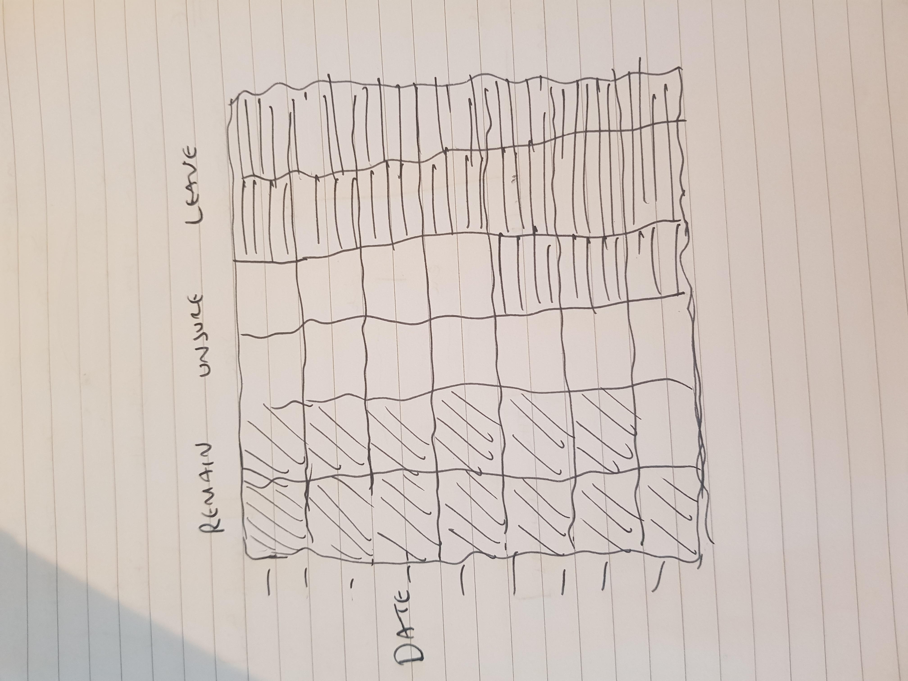

@import "../../css/datavis.less"

```elm {l=hidden}
import Tidy exposing (..)
import VegaLite exposing (..)
```

<!-- Everything above this line should probably be left untouched. -->

# Session 1: Practical Exercises

{(task|}

Use this document as a place to add your answers to the week's practical exercises.

{|task)}

## Q.3 Datavis Evaluation

_Add your 5-point critique here (see Q.3 of the session 1 practical exercises)._

1. Represents a complex dataset graphically that could not as effectively be represented via other means.

A View On Despair
by Sonja Kuijpers - Studio Terp
URL [https://www.informationisbeautifulawards.com/showcase/4313-a-view-on-despair]

Brief: With a large data-art landscape and accompanying charts I show the data on suicide numbers of 2017 from the Netherlands. Elements like trees, waves and clouds represent the categories of suicide methods. This project derived from my personal struggle with depression.

2. Often emphasises connections and comparisons between items of data.

Sonja has used the peaceful and beautiful digital art concept to portray hard to talk about details of suicide. The landscape, each element in it represents a person who committed suicide in the Netherlands in the year 2017.

She used trees for hanging and strangulation. Clouds for drugs, alcohol and medication overdose. Horizon lights for in front of train or metro.

Waves for drowning and buildings for jumping from heights.

She also used grass for other methods and stars for unknown methods.

She represented the date by plotting the above representation and created a clear comparison.

The categories are split into 8 age-groups between < 20 years and > 80 years. 

Differences in colour, form and/or size of the elements show the different age-groups. 

The landscape is “split” into men and women: men on the left, women on the right.

3. Frequently involves interaction to allow a user to influence what they see.

Sonja took a hard to talk about topic and aimed to inform the viewer of crisis in Natehrland.

"Since the 2008 economic crisis the number of suicides in several countries increased. From international research it appears suicide can correlate with an economical crisis. It’s unknown if and in what way financial misery influenced the increase of suicides in the Netherlands. Either way, there are relatively few suicides in the Netherlands compared to other countries." - Sonja Kuijpers

4. A narrative providing a clear answer to a question without extraneous details.

Although this is a very carefully put together data visualisation piece, without looking at supporting data provided, the audience will struggle to understand what the image represents.

She has provided further data in easy to understand visualisation to give meaning to the image I am analysing. 

This can be found here: https://www.studioterp.nl/a-view-on-despair-a-datavisualization-project-by-studio-terp/


5. Generates an aesthetic response in order to encourage users to engage with the data or question.

As suicide rates rise, and stigma recedes, many discussions and portrayals are still clumsy or hurtful.

Suicide is on the rise around the globes, but people still don’t know quite how to talk about it.

Death is always messy and hard to understand, suicide even more so. It’s a broad and increasingly a public-health problem with a million different faces, affected by many factors. 

Mental illness is one of them, but the CDC also found that experiences such as relationship problems, financial problems, loss of housing, and substance use, among others, contributed to some suicide deaths. 

The traumas and losses of people’s lives and the ways they respond to them are infinitely varied and context-dependent. And that makes suicide hard to talk about.

Sometimes a restricting sort of politeness, the desire not to bother each other, can build walls between people.

Sonja Kuijpers is breaking those walls by her use of data and art to create connection and openness between people to allow us to understand how we can talk about this vital topic.

## Q.4 Bicycle Hires Visualization

---
elm:
    dependencies:
        gicentre/elm-vegalite: latest
---

```elm {l=hidden}
import VegaLite exposing (..)
```


```elm {l v}
myBarchart : Spec
myBarchart =    
    let
        data =
            dataFromUrl "https://gicentre.github.io/data/bicycleHiresLondon.csv"

        enc =
            encoding
                << position X [ pName "Month", pTemporal ]
                << position Y [ pName "NumberOfHires", pQuant ]
                << color [ mName "AvHireTime", mQuant ]


    in
    toVegaLite [ width 640, data [], enc [], bar [] ]
```

QQ. What explains the darker bars during 2020? Can you say anything else about the relationship between the number of bicycle hires and the average duration of each hire?

Darker color lightness refer to an higher average hire time then any other time.


## Q.5 Creating a Scatterplot

---
elm:
    dependencies:
        gicentre/elm-vegalite: latest
---

```elm {l=hidden}
```


```elm {l v}
--function myBarChart
myBarchart1 : Spec
myBarchart1 =    
    let
        data =
            dataFromUrl "https://gicentre.github.io/data/bicycleHiresLondon.csv"

        enc =
            encoding
                << position X [ pName "Month", pTemporal ]
                << position Y [ pName "NumberOfHires", pQuant ]
                << color [ mName "AvHireTime", mQuant ]


    in
    toVegaLite [ width 640, data [], enc [], circle [] ]
```

### Feedback on Scatter plot

You many also notice that outliers of longer than usual hire times (27 to 36 minutes) as isolated dots towards the top of the
chart.

The correlation between the two variables invites an explanation of the cause. Perhaps both are influenced by weather, with summer months both encouraging more people to cycle and to cycle for longer.

But perhaps you can think of other explanations (e.g. do you think the reason people use the bikes might change during the year?). 

The Covid period might provide a clue as to why there May to July show much longer average journey times than in previous years.


## Q.6 Data Challenge

---
elm:
    dependencies:
        gicentre/elm-vegalite: latest
---

```elm {l=hidden}
```


```elm {l v}
myBarchart2 : Spec
myBarchart2 =    
    let
        data =
            dataFromUrl "https://gicentre.github.io/data/euPolls.json"

        enc =
            encoding
                << position Y [ pName "Percent", pTemporal ]
                << position X [ pName "Answer", pOrdinal ]
                << color [mName "Percent", mTemporal]


    in
    toVegaLite [ width 640, data [], enc [], bar [] ]
```
## Q.7 Design Challenge

This represents a chessboard as many people believed the negotiation for Brexit was a game of chess between the UK and Europe during the negotiation.

Colours will alternate for Remain, Unsure and Leave. I intend on representing the Date as a colour gradient.




##Feedback

```elm {v}
myBarchart5 : Spec
myBarchart5 =
    let
        data =
            dataFromUrl "https://gicentre.github.io/data/bicycleHiresLondon.csv" []
        enc =
            encoding
                << position X [ pName "Month", pTemporal ]
                << position Y [ pName "NumberOfHires", pQuant ]
    in
    toVegaLite [ width 640, data, enc [], bar [] ]
```

### Aim
To show the pattern of hires over time in order to identify any seasonal cycles and longer term trends.

### Observation
The winter-summer variation is very clear from the time series with peaks in July/August of each year and fewest hires every December. 

There is a gradual longer term increase in hires but this is minor in comparison to the seasonal variation. Since the lockdown was relaxed in 2020, there has been a large increase in numbers of hires.


## Data Challenge

```elm {v}
euChart : Spec
euChart =
    let
        data =
            dataFromUrl "https://gicentre.github.io/data/euPolls.json" []
        enc =
            encoding
                << position X [ pName "Date", pTemporal ]
                << position Y [ pName "Percent", pQuant ]
    in
    toVegaLite [ width 600, data, enc [], line [] ]
```

```elm {v}

euChart1 : Spec
euChart1 =
    let
        data =
            dataFromUrl "https://gicentre.github.io/data/euPolls.json" []
        enc =
            encoding
                << position X [ pName "Date", pTemporal ]
                << position Y [ pName "Percent", pQuant ]
                << color [ mName "Answer" ]
    in
    toVegaLite [ width 600, data, enc [], line [] ]

```


### Adding filters

```elm {v}

euChart2 : Spec
euChart2 =
    let
        data =
            dataFromUrl "https://gicentre.github.io/data/euPolls.json" []

        trans =
            transform
                << filter (fiExpr "datum.Answer == 'leave'")

        enc =
            encoding
                << position X [ pName "Date", pTemporal ]
                << position Y [ pName "Percent", pQuant ]
                << color [ mName "Answer" ]
    in
    toVegaLite [ width 600, data, trans [], enc [], line [] ]

```


### Bar charts

```elm {v}

euChart21 : Spec
euChart21 =
    let
        data =
            dataFromUrl "https://gicentre.github.io/data/euPolls.json" []

        trans =
            transform
                << filter (fiExpr "datum.Answer == 'leave'")

        enc =
            encoding
                << position X [ pName "Date", pTemporal ]
                << position Y [ pName "Percent", pQuant ]
                << color [ mName "Answer" ]
    in
    toVegaLite [ width 600, data, enc [], bar [] ]

```


### Area charts

```elm {v}

euChart212 : Spec
euChart212 =
    let
        data =
            dataFromUrl "https://gicentre.github.io/data/euPolls.json" []

        trans =
            transform
                << filter (fiExpr "datum.Answer == 'leave'")

        enc =
            encoding
                << position X [ pName "Date", pTemporal ]
                << position Y [ pName "Percent", pQuant ]
                << color [ mName "Answer" ]
    in
    toVegaLite [ width 600, data, enc [], area [] ]

```