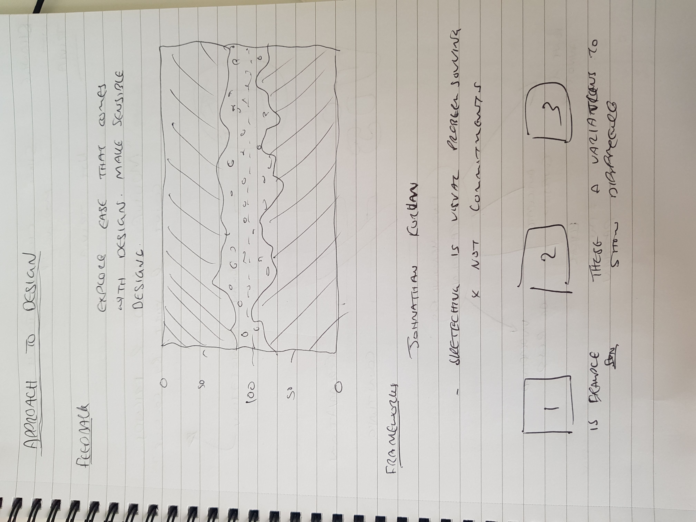
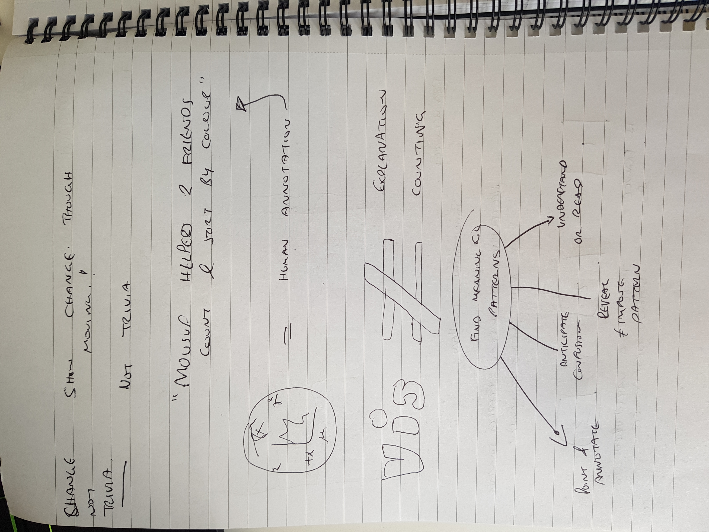
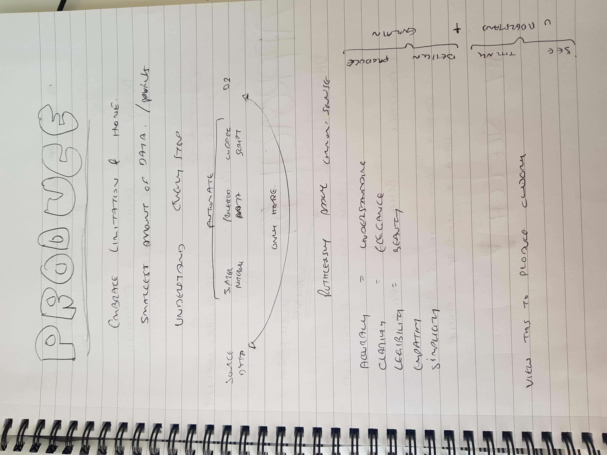
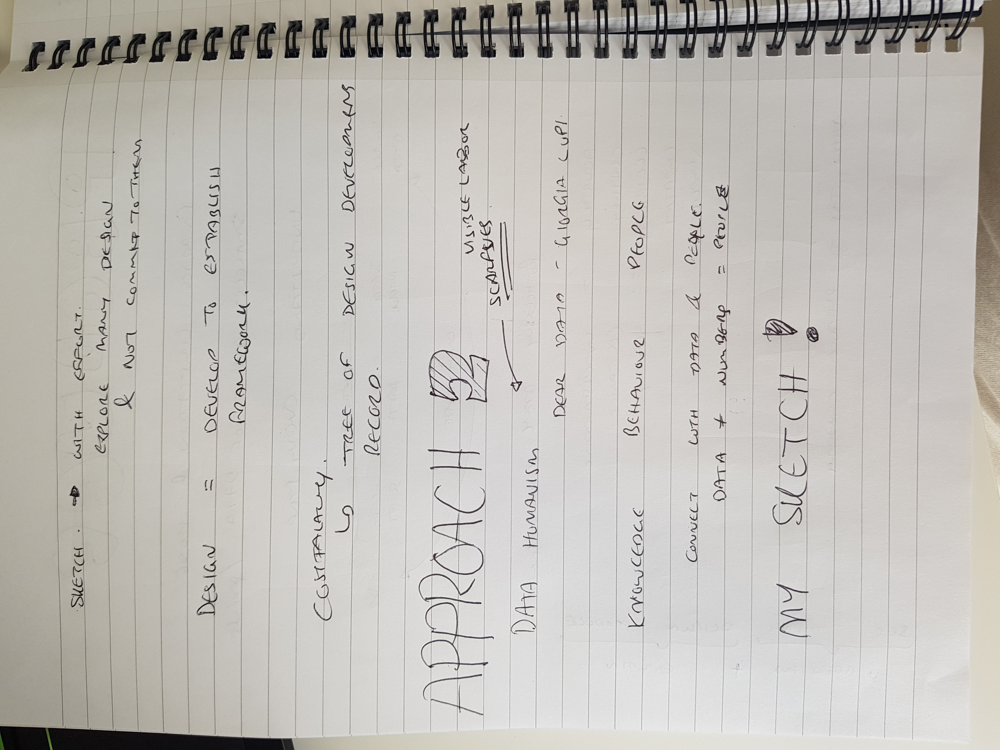
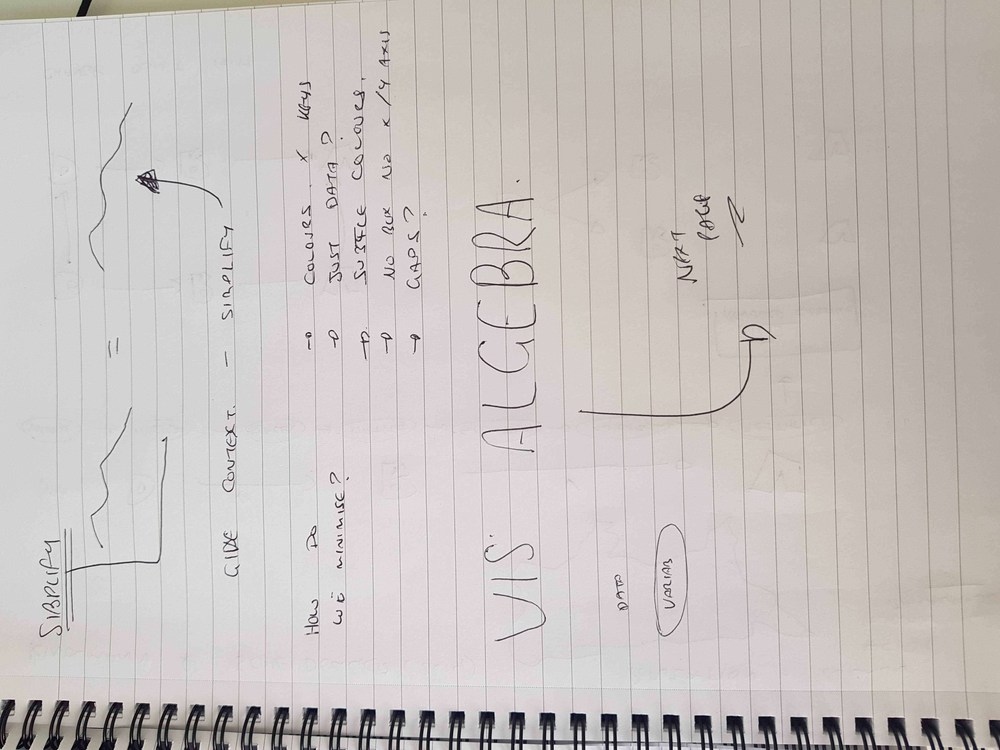
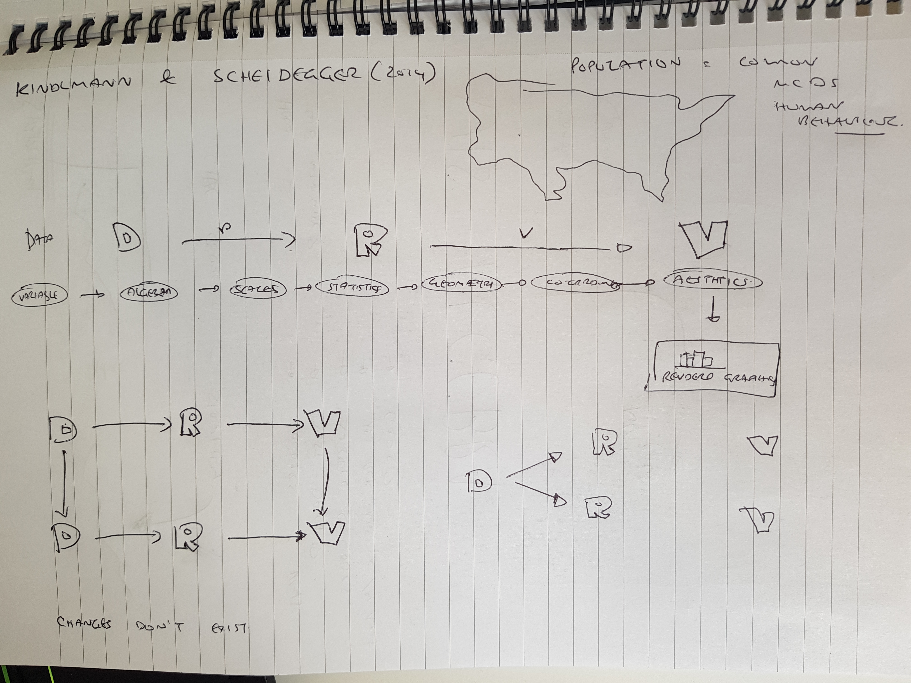

@import "../../css/datavis.less"

```elm {l=hidden}
import Tidy exposing (..)
import VegaLite exposing (..)
```

<!-- Everything above this line should probably be left untouched. -->

# Session 2: Practical Exercises

{(task|}

##What pieces of advice from the talk are most persuasive to you?

The goal is to find a clear though, find that one clear thought ...... and then get it down on paper.


To what extent do you agree with Corum's statement that "the goal of the design process is to find a clear thought and then show it."?


** To what extent do you agree with Corum's statement that "visualization is not counting" and that it should only "find and show meaningful patterns"?**

The purpose of an academic data visualisation is to discover new and improved ways of communicating with data. This is why I believe it is important to not only find and show meaningful patterns but to also experiment with all possible outcomes where possible.

##To what extent do you agree with Corum's statement that "the goal of the design process is to find a clear thought and then show it."?

I believe this is important as every piece of data should be seen as individual task. This is because one visualisation will not necessarily work on another.


##Humanisation
As an example, consider [Sara Weber's train delay scarf](https://www.theguardian.com/world/2019/jan/14/german-train-delay-scarf-ebay-commute).

 _Photo: Sara Weber / Twitter_

#Is this a data visualization? What elements of it embrace _data humanism_ and _feminist data visualization_?

It is a scarf, an object used for humanism.

{|task)}


## 1. Evaluating Design Approaches









## 2. Creating a Minimalist Tufte Visualization


