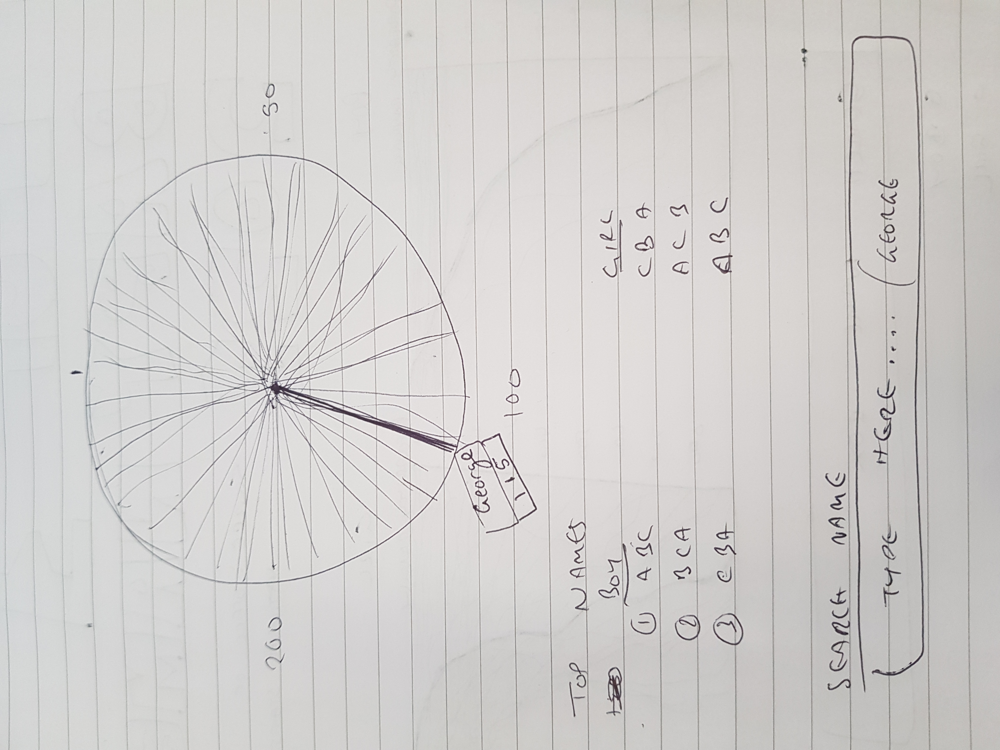

@import "../../css/datavis.less"

```elm {l=hidden}
import Tidy exposing (..)
import VegaLite exposing (..)
```

<!-- Everything above this line should probably be left untouched. -->

# Session 3: Practical Exercises

{(task|}

### 1. 

### 2. 

```elm {v}
attendance2 : Spec
attendance2 =
    let
        cfg =
            configure
                << configuration (coView [ vicoStroke Nothing ])
                << configuration (coAxis [ axcoTicks False, axcoDomain False, axcoLabelAngle 0 ])

        data =
            dataFromUrl "https://gicentre.github.io/data/attendance.csv"
                -- Force session values to be treated as numbers not text
                [ parse [ ( "session", foNum ) ] ]

        enc =
            encoding
                << position X [ pName "session" ]
                << position Y
                    [ pName "attendance"
                    , pQuant
                    , pStack stCenter -- Stacked from the centre not bottom.
                    , pAxis []
                    ]
                << detail [ dName "id" ]
                << color [ mName "cohort" , mScale [scScheme "plasma"[]]
                    ]

                
    in
    toVegaLite
        [ width 600
        , height 300
        , cfg []
        , data
        , enc []
        , area
            [ maLine (lmMarker []) -- Add lines around each area 'stream'
            , maInterpolate miMonotone -- Monotone interpolation gives curved lines
            ]
        ]
```

### 3. 

```elm { v}
barchart : Spec
barchart =
    let
        data =
            dataFromUrl "https://gicentre.github.io/data/temperatureAnomalies.json"
                [ parse [ ( "Anomaly", foNum ) ] ]

        enc =
            encoding
                << position X [ pName "Date", pAxis [axLabelAngle 0] ]
                << position Y [ pName "Anomaly", pQuant ]
                << color [mName "Anomaly", mQuant, mScale [scScheme "redblue"[] 
                ,scDomain (doMid 0)]
                ]
  
    in
    toVegaLite [ width 600, data, bar [], enc [] ]
```

### 4. Design Challenge


{|task)}
