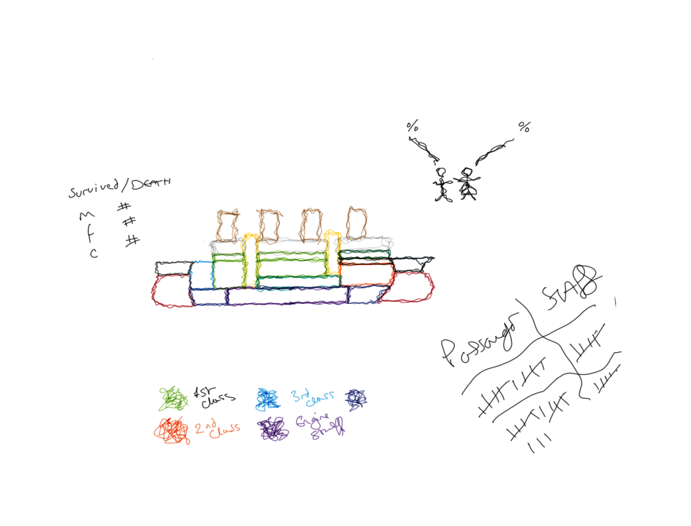

@import "../../css/datavis.less"

```elm {l=hidden}
import Tidy exposing (..)
import VegaLite exposing (..)
```

<!-- Everything above this line should probably be left untouched. -->

# Session 5: Practical Exercises

{(task|}

Use this document as a place to add your answers to the week's practical exercises.


### 1. Tidying Data Tables

Which of the following tables are in 'tidy' format? For those that are not, provide a tidy version of the table (you can do this manually by adding markdown tables to this document – there's no need to use elm code to do so.)

#### (a) UK General Election Results 2019

This table is tidy. 

If noMPs was percentage and it was presenting 

| Party                     | percentVote | numMPs |
| :------------------------ | ----------- | ------ |
| Conservative              | 43.6        | 365    |
| Labour                    | 32.2        | 202    |
| Scottish National Party   | 3.9         | 48     |
| Liberal Democrats         | 11.6        | 11     |
| Democratic Unionist Party | 0.8         | 8      |

#### (b) Tokyo 2021 Paralympic Medal Table

The table is not tidy, we are not changing value of data but moving things around.

| Rank | Country | NumGold | MedalType | 
| ---- | :------ | ------- | --------- | 
| 1    | China   | 96      | Gold      | 
| 2    | China   | 60      | Silver    | 
| 3    | China   | 51      | Gold      | 


| Rank | Country | NumGold | NumSilver | NumBronze |
| ---- | :------ | ------- | --------- | --------- |
| 1    | China   | 96      | 60        | 51        |
| 2    | GB      | 41      | 38        | 45        |
| 3    | US      | 37      | 36        | 31        |
| 4    | RPC     | 36      | 33        | 49        |

(RPC = Russia Paralympic Committee)

#### (c) Mexico weather station temperature readings

This is  tidy.
When researching, we will be asking diffrent question for min and max temp during the day.

Has the day time max temprature changed over time and I may only be interested in max?

Temprature range during the day.

Sometimes need the context of analysis before judging is tidy or not

| id      | date       | maxTemperature | minTemperature |
| ------- | ---------- | -------------- | -------------- |
| MX17004 | 2010-01-30 | 27.8           | 14.5           |
| MX17004 | 2010-02-02 | 27.3           | 14.4           |
| MX17004 | 2010-02-03 | 24.1           | 14.4           |
| MX17004 | 2010-02-11 | 29.7           | 13.4           |
| MX17004 | 2010-02-23 | 29.9           | 10.7           |
| MX17004 | 2010-03-05 | 32.1           | 14.2           |
| MX17004 | 2010-03-10 | 34.5           | 16.8           |
| MX17004 | 2010-03-16 | 31.1           | 17.6           |
| MX17004 | 2010-04-27 | 36.3           | 16.7           |
| MX17004 | 2010-05-27 | 33.2           | 18.2           |


This is how it would look if the.

| id      | date       | Temperature | maxOrMin |
| ------- | ---------- | -------------- | -------------- |
| MX17004 | 2010-01-30 | 27.8           | max          |
| MX17004 | 2010-01-30 | 14.5           | min           |


#### (d) UK General Election Results 2017 and 2019

This is not tidy, turn to like medal table.
Each row are observation i.e. 2017 and 2019

| Party                     | percentVote2017 | numMPs2017 | percentVote2019 | numMPs2019 |
| ------------------------- | --------------- | ---------- | --------------- | ---------- |
| Conservative              | 42.3            | 317        | 43.6            | 365        |
| Labour                    | 40.0            | 262        | 32.2            | 202        |
| Scottish National Party   | 3.0             | 35         | 3.9             | 48         |
| Liberal Democrats         | 7.4             | 12         | 11.6            | 11         |
| Democratic Unionist Party | 0.9             | 10         | 0.8             | 8          |


### 2. Tidying tables programmatically

For those tables in the previous question that are not in tidy format, create functions to create and tidy them using Tidy's [fromCSV](https://package.elm-lang.org/packages/gicentre/tidy/latest/Tidy#fromCSV) and [gather](https://package.elm-lang.org/packages/gicentre/tidy/latest/Tidy#gather) functions. Confirm you have tidied the tables correctly by displaying the tables using [tableSummary](https://package.elm-lang.org/packages/gicentre/tidy/latest/Tidy#tableSummary).


```elm {l}
tableB: Table
tableB =
    """Rank,Country,NumGold, NumSilver, NumBronze,
        1,China,96,60,51
        2,GB,41,38,45
        3,US,37,36,31
        4,RPC,36,33,49"""
          |> fromCSV
          |> gather "numberOfMedals" "typeOfMedal"
              [("NumGold", "gold")
              , ("NumSilver", "silver")
              ,("NumBronze", "bronze")              
              ]   -- Tuples

-- It doesn't matter if they are in diffrent order of rows

```
^^^elm {m=(tableSummary -1 tableB)}^^^


```elm {l}
tableC: Table
tableC =
    """Party,percentVote2017,numMPs2017, percentVote2019, numMPs2019,
        Conservative,42.3,317,43.6,365
        Labour,40.0,262,32.2,202
        Scottish National Party,3.0,35,3.9,48
        Liberal Democrats,7.4,12,,11.6,11
        Democratic Unionist Party,0.9,10,0.8,8
        """
          |> fromCSV
          |> gather "numberOfMedals" "typeOfMedal"
              [("NumGold", "gold")
              , ("NumSilver", "silver")
              ,("NumBronze", "bronze")              
              ]
```

```
^^^elm {m=(tableSummary -1 tableC)}^^^


EMBRACE COMPLEXITY
I focused on embracing complexity for humanism.





{|task)}
