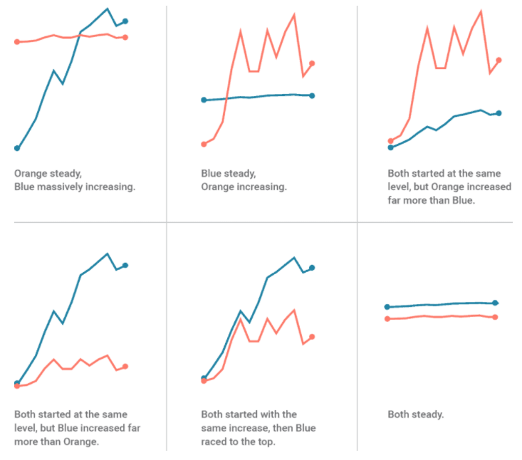

@import "../../css/datavis.less"

```elm {l=hidden}
import Tidy exposing (..)
import VegaLite exposing (..)
```

<!-- Everything above this line should probably be left untouched. -->

# Session 7: Practical Exercises

{(task|}

Use this document as a place to add your answers to the week's practical exercises.

### 1. Juxtaposition vs Superposition vs Direct Encoding

Complete the following table providing a rationale for your layout choice (one of (J)uxtapose, (S)uperpose and (D)irect encoding) for each research question.

| Research Question                                                            | J, S or D? | Rationale |
| ---------------------------------------------------------------------------- | ---------- | --------- |
| How do monthly rainfall patterns compare in Sheffield and Manchester?        |    J        |     By having 2 diffrent visuals crating a juxtaposition, we are able to create the fact of two things being seen or placed close together with contrasting effect. Making it easier to see the pattern comparison. I would use spatial juxtaposition to present it in rows adjacent to eachother. |
| In which age cohorts have covid cases changed the most over time?            |      J      |     Due to the importance of data I would detail out the change in covid cases per age. If I wanted to compare the data at a later stange, I willy use a superpose approach.       |
| How do numbers of goals scored over a 5 decades vary between football teams? |      D      |      I think this data is a big piece of data. By using direct encoding of basic arithmetics to simplify the data and compare football teams.     |
| To what extent does penguin morphology vary by island?                       |      S      |     By superposing penguine morphology on or above islands, especially so the data coincide to a pattern. I will make use of colour to distinguish the data.     |



[Superpose Statement]

### 2. Parallel Coordinates Plots

Using the penguin data parallel coordinate plot and scatterplot matrix discussed above for reference,

- What would positively and negatively correlated pairs variables look like on a parallel coordinate plot?

One thing that stood out to me is how much easier it is to see the clear data on the parallel coordinates plot. An example of this is how Gentoo has a linear pattern from beak depth, length, body mass and flipper length. Where as this is not easy to spot in the scatterplot matrix. 

However it is easier to use a sactterplot matrix to select specific data and compare against the other juxtaposed visualised data.

- Do crossing lines have any meaning? What is your reasoning?


--
- What are the relative advantages and disadvantages of the parallel coordinate plot compared with the scatterplot matrix?

Parallel plot or parallel coordinates plot allows to compare the feature of several individual observations (series) on a set of numeric variables. Each vertical bar represents a variable and often has its own scale. (The units can even be different). Values are then plotted as series of lines connected across each axis.

```elm {l}
penguinData =
    dataFromUrl "https://vega.github.io/vega-lite/data/penguins.json" []
```
```elm {v highlight=[9-22,29,37]}
pcp : Spec
pcp =
    let
        cfg =
            configure
                << configuration (coView [ vicoStroke Nothing ])

        trans =
            transform
                -- Some penguins don't have a beak length measurement so only include those that do.
                << filter (fiExpr "datum['Beak Length (mm)']")
                -- Give each sample a unique index
                << window [ ( [ wiAggregateOp opCount ], "index" ) ] []
                -- Gather the four morphology types into a tidy table
                << foldAs [ "Beak Length (mm)", "Beak Depth (mm)", "Flipper Length (mm)", "Body Mass (g)" ]
                    "morphology"
                    "magnitude"
                -- Find the min and max values for each morphology
                << joinAggregate [ opAs opMin "magnitude" "min", opAs opMax "magnitude" "max" ]
                    [ wiGroupBy [ "morphology" ] ]
                -- Calculate a normalised version of each measurement
                << calculateAs "(datum.magnitude - datum.min) / (datum.max-datum.min)" "normVal"

        encLine =
            encoding
                << position X [ pName "morphology", pAxis [ axLabelAngle 0, axDomain False ] ]
                << position Y [ pName "normVal", pQuant, pAxis [] ]
                << color [ mName "Species" ]
                << detail [ dName "index" ]

        specLine =
            asSpec [ encLine [], line [ maOpacity 0.3 ] ]

        encAxis =
            encoding
                << position X [ pName "morphology", pTitle "" ]
                << detail [ dAggregate opCount ]

        specAxis =
            asSpec [ encAxis [], rule [ maColor "#ccc" ] ]
    in
    toVegaLite
        [ cfg []
        , width 600
        , height 300
        , penguinData
        , trans []
        , layer [ specLine, specAxis ]
        ]
```

### 3. Layout in your datavis project

Thinking about your research questions for your datavis project, jot down some notes prompted by the following questions:

- What kinds of comparison task should your visualization be able to support in order to answer your research questions?

I am reconsidering the data I will be using. However I think it will be important to compare data using Parallel Coordinates Plots to see if there are any linear trends.

- How will you use position within any given chart design to support comparison?
I am not sure.

- How might you arrange multiple views via superposition, juxtaposition and direct encoding to support comparison?

I liked the following example of temporal juxtaposition example:


```elm {l}
cycleHireData =
    dataFromUrl "https://gicentre.github.io/data/bicycleHiresLondon.json" []
```

```elm {v interactive}
temporalJuxtapositionExample : Spec
temporalJuxtapositionExample =
    let
        ps =
            params
                << param "t" [ paValue (num 0), paBind (ipRange [ inName "Hires ⬄ HireTime", inMax 1 ]) ]

        trans =
            transform
                << joinAggregate [ opAs opMax "NumberOfHires" "maxHires" ] []
                << joinAggregate [ opAs opMax "AvHireTime" "maxHireTime" ] []
                << calculateAs "datum.NumberOfHires/datum.maxHires" "normHires"
                << calculateAs "datum.AvHireTime/datum.maxHireTime" "normHireTime"
                << calculateAs "datum.normHireTime*t + datum.normHires*(1-t)" "interpolated"

        enc =
            encoding
                << position X [ pName "Month", pTemporal, pTitle "" ]
                << position Y [ pName "interpolated", pQuant, pAxis [ axTitle "", axLabels False ] ]
    in
    toVegaLite [ width 600, ps [], cycleHireData, trans [], enc [], line [] ]
```

I would like to try this approach and see how comparing my data feels. I will like to see if there is a way to change colour between the positions. 


{|task)}
